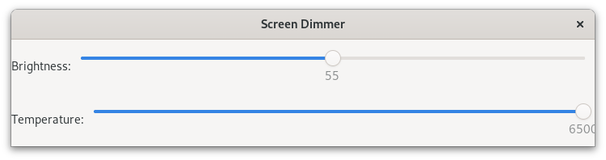

# gnome-screen-dimmer

A simple screen dimmer application for GNOME. It calls the `gnome-gamma-tool`
CLI under the hood: https://github.com/zb3/gnome-gamma-tool



## Why

My monitor is too bright for me even with the brightness set to the lowest
settings. Previously I could get the screen even dimmer by using `xrandr` in
xorg and `wl-gammactl` in wayland environments. But in GNOME neither of those
options work, so I use `gnome-gamma-tool` instead. This application is a GUI for
`gnome-gamma-tool`'s brightness and temperature settings.

## Usage

There's no need to install this, just clone this repository. The application is
a script that runs on GJS, which is provided by GNOME out of the box.

```sh
git clone --recursive https://github.com/0xca551e/gnome-screen-dimmer.git
cd gnome-screen-dimmer
gjs gnome-screen-dimmer.js
```

## Development / Building

[Deno](https://deno.com/) is required to build the app.

Build and run the application with the following command:

```sh
deno task build
```

Any changes in `src/` will automatically rebuild and restart the application.
